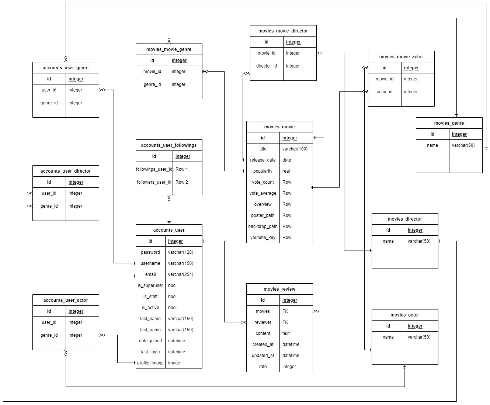

# MOVE

## 목차

1. [개요](#1.개요)
2. [프로젝트 기간](#2.프로젝트_기간)
3. [기술 스택](#3.기술_스택)
4. [팀원](#4.팀원)
5. [DataBase 설계](#5.DataBase_설계)
6. [주요 기능](#6.주요_기능)

 

## 1. 개요

-   유저의 취향을 기반으로 영화 추천 서비스 제공
-   팔로우한 유저를 기반으로 영화 추천 서비스 제공
-   작성한 리뷰의 개수로 랭킹을 부여하는 커뮤니티 서비스 제공

## 2. 프로젝트 기간

-   2022년 11월 17일 ~ 2022년 11월 24일

## 3. 기술 스택

-   Framework : [Django 3.2.13](https://docs.djangoproject.com/en/4.1/releases/3.2.13/)
-   Framework : [Vue 2.7.14](https://github.com/vuejs/vue/releases)
-   API : [Naver Papago 번역](https://developers.naver.com/products/papago/nmt/nmt.md)
-   API : [TMDB 영화 조회](https://developers.themoviedb.org/3/movies/get-movie-details)
-   Language : [Python 3.10.6](https://www.python.org/downloads/release/python-3106/)
-   Database : [sqlite](https://www.sqlite.org/index.html)

## 4. 팀원

-   정현석 (팀장)
    -   Front-End
    -   화면 및 데이터 설계
-   김원웅 (팀원)
    -   Back-End
    -   DB 및 API 설계

## 5. DataBase 설계

## 6. 주요 기능

`추가예정`

-   나중에 추가
-   로그인 / 회원가입
-   메인 페이지
    -   팝업
    -   팝업 좋/싫/찜
    -   무비 디테일
    -   무비 디테일 좋/싫/찜
    -   무비 디테일 리뷰
    -   무비 디테일 틴더로 이동
-   틴더
    -   틴더 좋/싫/찜
    -   틴더 선호 장르/배우/감독
-   랭킹
    -   유저 디테일로 이동
    -   팔로우
-   추천
    -   좋/싫/찜/롤백
    -   선호 장르 추가
-   마이 페이지로 이동
    -   프로필 사진 변경
